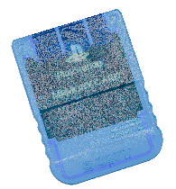

## What's up party people 🤘

I’m Ryosuke, I work at PlayStation prototyping new experiences across console, VR, mobile, and more. Before that I ran a cannabis publication and studio for over 10 years.

I do a lot of FOSS web dev and game dev, mostly in UI and tooling. You'll see me use a variety of different languages and technology, but I tend to hang around these usual suspects: **ReactJS**, [**Typescript**](https://github.com/whoisryosuke?tab=repositories&q=&type=source&language=typescript&sort=), [**Rust**](https://github.com/whoisryosuke?tab=repositories&q=&type=source&language=rust&sort=), [**C++**](https://github.com/whoisryosuke?tab=repositories&q=&type=source&language=c%2B%2B&sort=), [**Python**](https://github.com/whoisryosuke?tab=repositories&q=&type=source&language=python&sort=).

## Projects

### Big Projects

| Project                                                                                    | Description                                            | Category                                | Blog                                                                                                                                                             |
| :----------------------------------------------------------------------------------------- | :----------------------------------------------------- | :-------------------------------------- | :--------------------------------------------------------------------------------------------------------------------------------------------------------------- |
| [**ryosuke-next-blog-2023**](https://github.com/whoisryosuke/ryosuke-next-blog-2023)       | My current personal blog and portfolio                 | 📘💻                                    | [🔗](https://whoisryosuke.com/blog/2024/the-vision-pro-redesign-of-2024)                                                                                         |
| [**oat-milk-design**](https://github.com/whoisryosuke/oat-milk-design)                         | UI library for prototyping on web | 💻🎨                                    |                                                                                                                                                              |
| [**react-vite-library-boilerplate**](https://github.com/whoisryosuke/react-vite-library-boilerplate)                         | Template for making JS/TS libraries | 📘💻                                    |  [🔗](https://whoisryosuke.com/blog/2025/releasing-a-react-library-in-2025)                                                                                                                                                             |
| [**next-mdx-deck**](https://github.com/whoisryosuke/next-mdx-deck)                         | A NextJS template for creating slideshow presentations | 📘💻                                    | [🔗](https://whoisryosuke.com/blog/2020/creating-speaker-decks-with-nextjs-and-mdx)                                                                                                                                                               |
| [**ryoturia-web**](https://github.com/whoisryosuke/ryoturia-web)           | Web-based 3D MIDI Piano                              | 💻🎹                                      | [🔗](https://whoisryosuke.com/blog/2024/making-a-3d-piano-in-threejs)                                                                                                                                                                   |
| [**r3f-experiments**](https://github.com/whoisryosuke/r3f-experiments)           | React Three Fiber / ThreeJS Sketchbook                             | 💻🎮🎹                                      |                                                                                                                                                                   |
| [**p5-experiments**](https://github.com/whoisryosuke/p5-experiments)           | p5.js Sketchbook                             | 💻🎮🎹                                      |                                                                                                                                                              |
| [**entourage**](https://github.com/whoisryosuke/entourage-v2)           | Project launcher app                             | 💻                                      |                                                                                                                                                                  |
| [**midi-synthesizer-app**](https://github.com/whoisryosuke/midi-synthesizer-app)           | Web-based MIDI synthesizer                             | 🎹                                      |                                                                                                                                                                  |
| [**bevy-midi-playground**](https://github.com/whoisryosuke/bevy-midi-playground)           | MIDI synth in the Bevy game engine                     | 🎹🎮                                    |
| [**react-unified-input**](https://github.com/whoisryosuke/react-unified-input)             | Multi-device input management for React                | 🎮⌨️ | [🔗](https://whoisryosuke.com/blog/2024/focus-and-spatial-navigation-in-react)                                                                                   |
| [**react-gamepads**](https://github.com/whoisryosuke/react-gamepads)                       | Gamepad support for React                              | 🎮                                      | [🔗](https://whoisryosuke.com/blog/2020/adding-game-controller-input-to-react)                                                                                   |
| [**utility-props**](https://github.com/whoisryosuke/utility-props)                         | Utility style props for Web Components                 | 🎨                                      | [🔗](https://whoisryosuke.com/blog/2020/utility-props-for-web-components)                                                                                        |
| [**input-manager**](https://github.com/whoisryosuke/input-manager)                         | Multi-device input management for JS                   | 🎮⌨️                                    |                                                                                                                                                                  |
| [**wgpu-hello-world**](https://github.com/whoisryosuke/wgpu-hello-world)                   | Sandbox for WebGPU dev using Rust                      | 🌈                                      | [🔗](https://whoisryosuke.com/blog/2022/primitive-geometry-in-wgpu-and-rust)                                                                                     |
| [**webgpu-sandbox**](https://github.com/whoisryosuke/webgpu-sandbox)                   | Sandbox for WebGPU dev using JS                      | 🌈                                      |                                                                                     |
| [**geometry-node-graph**](https://github.com/whoisryosuke/geometry-node-graph)             | Export Blender geometry nodes for viewing on web       | 💻 | [🔗](https://whoisryosuke.com/blog/2023/exporting-geometry-nodes-from-blender)                                                                                   |
| [**blender-render-buddy**](https://github.com/whoisryosuke/blender-render-buddy)           | Blender addon that simplifies rendering                | 🎮⌨️                                    | [🔗](https://whoisryosuke.com/blog/2024/how-i-made-the-render-buddy-blender-plugin)                                                                              |
| [**blender-midi-motion**](https://github.com/whoisryosuke/blender-midi-motion)             | Import MIDI as animation into Blender                  | 🎹 | [🔗](https://whoisryosuke.com/blog/2024/midi-powered-animations-in-blender)                                                                                      |
| [**blender-gamepad**](https://github.com/whoisryosuke/blender-gamepad)                     | Control + animate in Blender with gamepad              | 🎮 | [🔗](https://whoisryosuke.com/blog/2024/using-gamepads-in-blender)                                                                                               |
| [**blender-design-token-manager**](https://github.com/whoisryosuke/blender-design-token-manager)                     | Manage design tokens in Blender              | 🎨 | [🔗](https://whoisryosuke.com/blog/2025/design-tokens-in-blender)                                                                                               |
| [**blender-render-dpi**](https://github.com/whoisryosuke/blender-render-dpi)                     | Use DPI measurement in Blender              | 🎨 | [🔗](https://whoisryosuke.com/blog/2024/bringing-print-to-blender-with-a-dpi-plugin)                                                                                               |
| [**ryos-blender-examples**](https://github.com/whoisryosuke/ryos-blender-examples)         | Examples of various techniques in Blender              |    |                                                                                                                                                                  |
| [**figma-css-theme-generator**](https://github.com/whoisryosuke/figma-css-theme-generator) | Generates CSS theme from Figma styles                  | 🎨     |                                                                                                                                                                  |
| [**styled-theme-generator**](https://github.com/whoisryosuke/styled-theme-generator)       | Generates Styled Components theme from Figma styles    | 🎨     | [🔗](https://whoisryosuke.com/blog/2020/syncing-figma-styles-with-css-in-js)                                                                                     |
| [**delta-skin-onyx**](https://github.com/whoisryosuke/delta-skin-onyx)                     | Dark skin for Delta app made using Blender             | 🎮🎨                                    | [🔗](https://whoisryosuke.com/blog/2024/the-guide-for-designing-delta-skins)                                                                                     |
| [**triple-triad**](https://github.com/whoisryosuke/triple-triad)                           | Triple Triad from FF8 remade on web                    | 🎮                                      | [🔗](https://whoisryosuke.com/blog/2024/recreating-triple-triad-in-reactjs)                                                                                      |
| [**bevy-galaga**](https://github.com/whoisryosuke/bevy-galaga)                             | Galaga in Bevy game engine                             | 🎮                                      | [🔗](https://whoisryosuke.com/blog/2023/making-galaga-in-rust-with-bevy-part-1)                                                                                  |
| [**bevy-katamari**](https://github.com/whoisryosuke/bevy-katamari)                         | Katamari Damacy in Bevy game engine                    | 🎮                                      | [🔗](https://whoisryosuke.com/blog/2023/making-katamari-for-bevy-game-jam)                                                                                       |
| [**solid-canvaskit-renderer**](https://github.com/whoisryosuke/solid-canvaskit-renderer)   | Native rendering using SolidJS + Skia                  | 💻🌈                                    | [🔗](https://whoisryosuke.com/blog/2022/ditch-the-dom-with-solidjs-and-skia-canvaskit) |

## GIFs

Check out [my GIFs on Giphy](https://giphy.com/whoisryosuke) and use them on social (or as stickers on IG).

